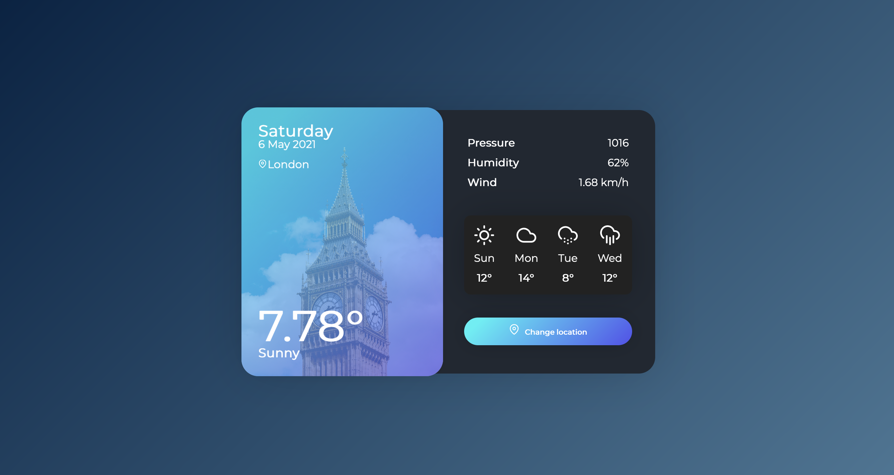

# Weather App

Weather app built with JavaScript and a weather API.

## 👀 Live demo

**[Check it out here.](https://jasonrowsell-weather.herokuapp.com)** The dates weather descriptions update automatically. As the user, you can change location and the relevant information will be displayed.




## 🏁 Getting Started

To run locally:

Get a copy of the Weather app running on your local machine (for playing around or development).

```sh
git clone git@github.com:jasonrowsell/weather
```

open the html file from terminal

```sh
cd weather
open src/index.html
```

At this point the application should be running on your machine at file:///Users/username/weather/src/index.html (or equivalent)

## Built Using

- HTML
- CSS
- JavaScript
- <a href="https://openweathermap.org/api">Open Weather API</a>
- <a href="https://feathericons.com/">Feather</a>
